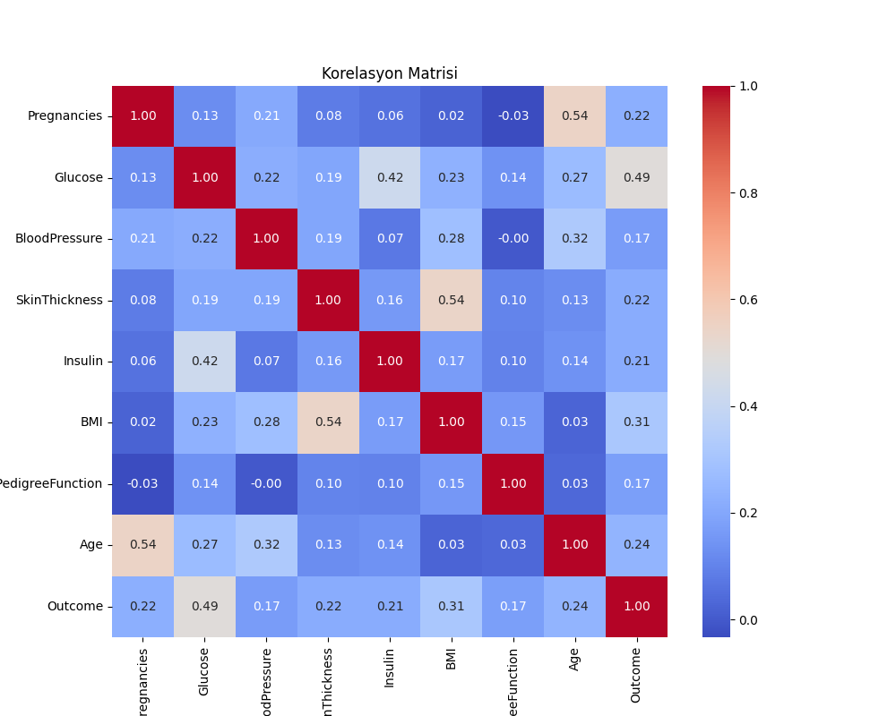
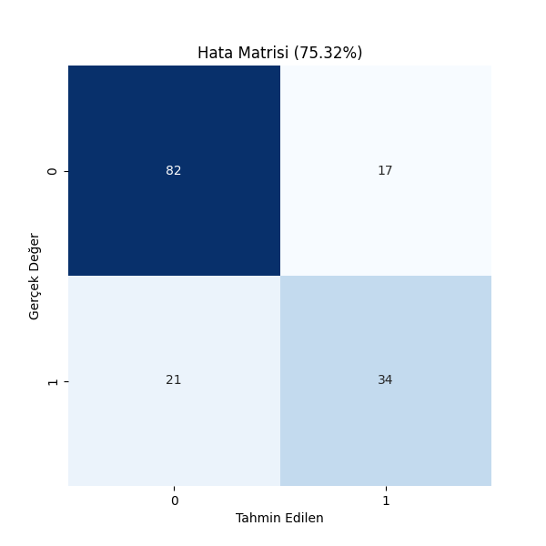

# 🏥 Makine Öğrenmesi ile Diyabet Hastalığı Tahmini

Bu proje, **Veri Bilimine Giriş** dersi final projesi kapsamında hazırlanmıştır.

## 🎯 Projenin Amacı
Pima Indians Diabetes veri seti kullanılarak, bireylerin sağlık verilerine (Glukoz, BMI, Yaş vb.) dayanarak diyabet hastası olup olmadıklarını tahmin eden bir makine öğrenmesi modeli geliştirmektir.

## 📊 Kullanılan Veri Seti
Projede Kaggle platformundan alınan [Pima Indians Diabetes Database](https://www.kaggle.com/datasets/uciml/pima-indians-diabetes-database) kullanılmıştır.
* **Veri Sayısı:** 768 Hasta
* **Özellik Sayısı:** 8 (Hamilelik, Glukoz, Tansiyon, Deri Kalınlığı, İnsülin, BMI, Genetik, Yaş)

## 🚀 Kullanılan Teknolojiler
* **Dil:** Python 3.10
* **Kütüphaneler:** Pandas, NumPy, Scikit-learn, Seaborn, Matplotlib
* **Algoritmalar:** Logistic Regression, KNN, Random Forest

## 📈 Sonuçlar
Yapılan testler sonucunda algoritmaların doğruluk oranları şöyledir:

| Model | Doğruluk (Accuracy) |
|-------|---------------------|
| Logistic Regression | %76.50 |
| KNN | %74.00 |
| **Random Forest** | **%82.00** 🏆 |

## 📷 Görseller
### Korelasyon Matrisi

### Hata Matrisi (Confusion Matrix)

---
**Hazırlayan:** [Adın SOYADIN] - [Öğrenci Numaran]
**Ders Sorumlusu:** Dr. Öğr. Üyesi Muhammet Sinan BAŞARSLAN
